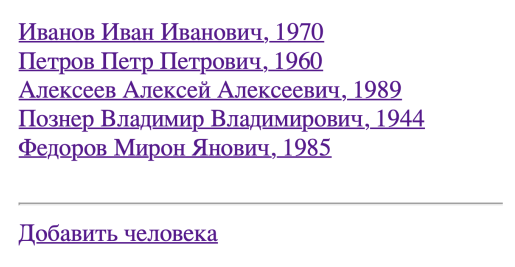
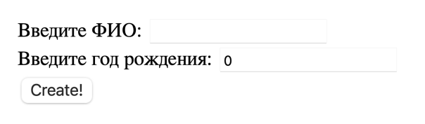
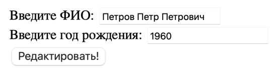
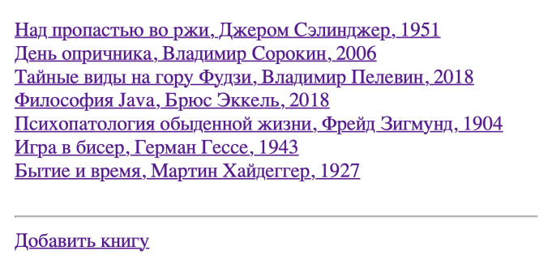
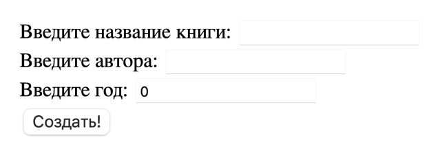
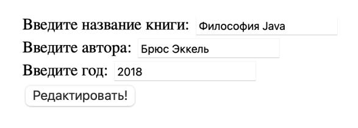
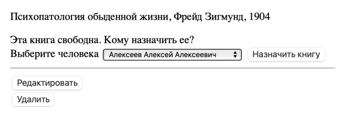
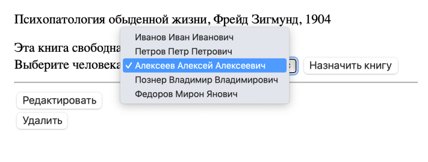
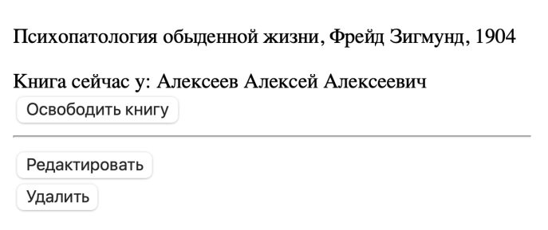

# Задание

В местной библиотеке хотят перейти на цифровой учет книг. Необходимо реализовать веб-приложение для них. Библиотекари должны иметь возможность регистрировать читателей, выдавать им книги и освобождать книги (после того, как читатель возвращает книгу обратно в библиотеку).

В базе данных должно быть две таблицы **Person** и **Book**. Для всех таблиц настроить автоматическую генерацию id. Для этого проекта создать базу данных с названием **project1**.

Сущности:

- **Человек** (поля: ФИО (UNIQUE), год рождения);
- **Книга** (поля: название, автор, год).

Отношение между сущностями: Один ко Многим. У человека может быть множество книг. Книга может принадлежать только одному человеку.

## Необходимый функционал:

1) Страницы добавления, изменения и удаления человека;
2) Страницы добавления, изменения и удаления книги;
3) Страница со списком всех людей (люди кликабельные - при клике осуществляется переход на страницу человека);
4) Страница со списком всех книг (книги кликабельные - при клике осуществляется переход на страницу книги);
5) Страница человека, на которой показаны значения его полей и список книг, которые он взял. Если человек не взял ни одной книги, вместо списка должен быть текст "Человек пока не взял ни одной книги";
6) Страница книги, на которой показаны значения полей этой книги и имя человека, который взял эту книгу. Если эта книга не была никем взята, должен быть текст "Эта книга свободна";
7) На странице книги, если книга взята человеком, рядом с его именем должна быть кнопка "Освободить книгу". Эта кнопка нажимается библиотекарем тогда, когда читатель возвращает эту книгу обратно в библиотеку. После нажатия на эту кнопку книга снова становится свободной и пропадает из списка книг человека;
8) На странице книги, если книга свободна, должен быть выпадающий список (тэг `<select>`) со всеми людьми и кнопка "Назначить книгу". Эта кнопка нажимается библиотекарем тогда, когда читатель хочет забрать эту книгу домой. После нажатия на эту кнопку, книга должна начать принадлежать выбранному человеку и должна появится в его списке книг;
9) Все поля должны валидироваться - с помощью аннотации `@Validate` и Spring Validator, если это требуется.

## Скриншоты со страницами

### Страница со списком всех людей `/people`

 \
*Скриншот страницы со списком всех людей*

### Страница добавления человека `/people/new`

 \
*Скриншот страницы добавления человека*

### Страница изменения человека `/people/{id}/edit`

 \
*Скриншот страницы изменения человека*

### Страница со списком всех книг `/books`

 \
*Скриншот страницы со списком всех книг*

### Страница добавления книги `/books/new`

 \
*Скриншот страницы добавления книги*

### Страница изменения книги `/books/{id}/edit`

 \
*Скриншот страницы изменения книги*

### Страница человека `/people/{id}`

 \
*Скриншот страницы человека*

### Страница книги `/books/{id}`

Книга в библиотеке и свободна.

 \
*Скриншот страницы книги*

В выпадающем списке все созданные люди.

 \
*Скриншот страницы книги*

Назначили книгу человеку.

 \
*Скриншот страницы книги*
